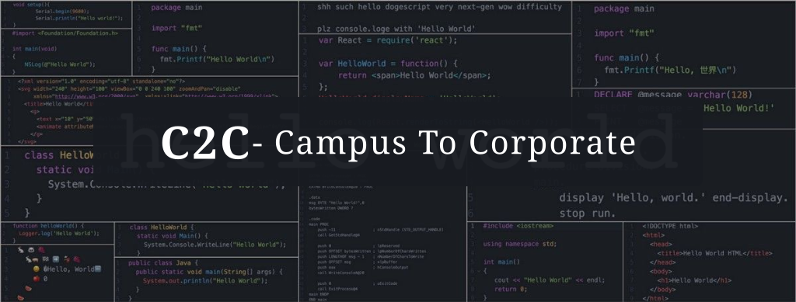
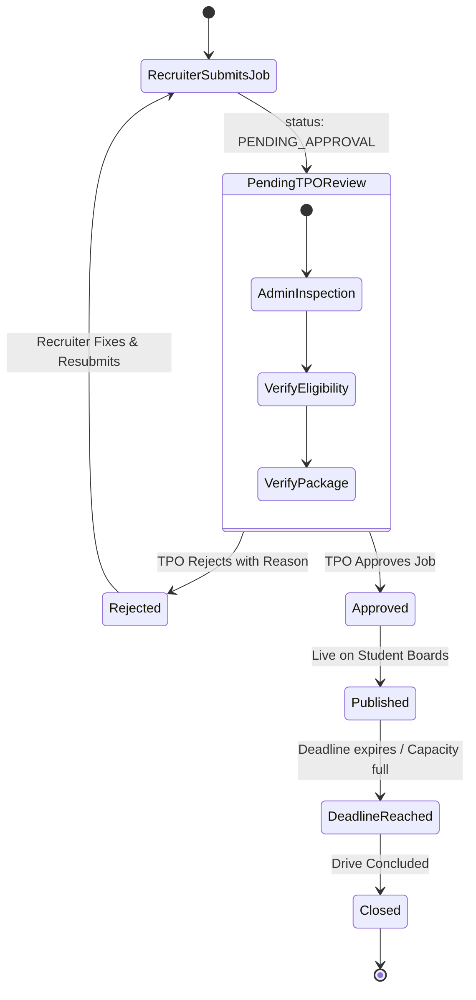
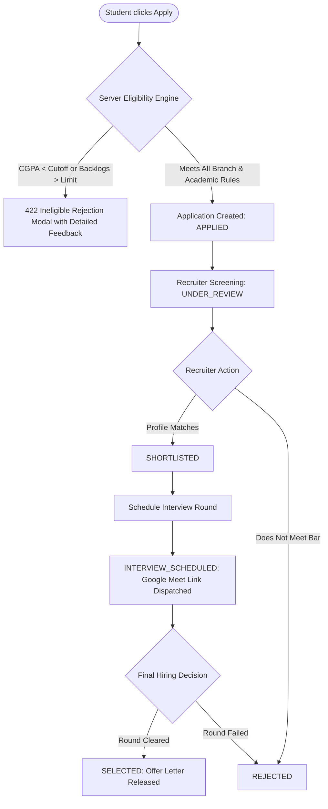

<p align="center">
  
</p>

<p align="center">
  <a href="#-tech-stack"></a>
  <a href="#-system-workflows--state-machines"></a>
  <a href="#-server-side-eligibility-engine"></a>
  <a href="#-work-evidence--engineering-audit-trail"></a>
  <a href="./LICENSE"></a>
</p>

---

## 📌 Executive Summary

**C2C (Campus-to-Corporate)** is an enterprise-grade recruitment and placement automation platform engineered for university placement cells (TPO), student applicants, and recruiting corporate partners. It streamlines campus placements with strict **three-tier architecture**, **server-enforced eligibility algorithms**, **role-based security boundaries (RBAC)**, interactive applicant pipelines, and transparent institutional audit logs.

---

## ⚡ Tech Stack

| Layer | Technology | Key Capabilities & Highlights |
| :--- | :--- | :--- |
| **Frontend UI** | **React 18 + TypeScript + Vite 5** | Tailwind CSS design system, Lucide icons, Recharts metrics, interactive SaaS sidebar & 3D tilt authentication card |
| **Backend API** | **Node.js + Express + TypeScript** | Strict REST routing, stateless JWT authentication, RBAC guards, Helmet security headers, rate-limiting |
| **Database & ORM** | **PostgreSQL 16 + Prisma ORM 5** | Normalized schema, relational transactions, migration tracking, automated seed scripts |
| **DevOps & Infra** | **Docker Compose** | One-command isolated PostgreSQL 16 containerization with health checks |

---

## ✨ Key Features & Capabilities

### 🎓 1. Student Portal
* **Automated Eligibility Checks**: Instant validation against CGPA cutoff, max active backlogs, and departmental eligibility.
* **1-Click Application Flow**: Server-validated application submission with duplicate-entry prevention.
* **Live Recruitment Pipeline Tracker**: Stage tracking from `Applied` → `Shortlisted` → `Interview Scheduled` → `Offered` / `Rejected`.
* **Interview Schedule Desk**: Real-time access to round timings, interviewers, and Google Meet/room links.
* **Direct Profile Sync**: Academic USN, CGPA, backlogs, branch, and secondary grade tracking.

### 💼 2. Recruiter Portal
* **Job & Internship Studio**: Create drives with customized compensation, department eligibility filters, and deadlines.
* **Applicant Kanban & Funnel**: Real-time review of candidate profiles, CGPA, and backlog histories.
* **Interview Scheduling Engine**: Direct interview round dispatching with date, time, and Google Meet integration.
* **Application Lifecycle Actions**: Progress candidates or issue offers/rejections with automated notifications.

### 🛡️ 3. Admin & Placement Cell (TPO) Portal
* **Company & Job Approval Hub**: Two-tier verification prevents unverified recruiters from publishing drives.
* **Student Academic Verification**: Audit student-reported CGPA and backlog counts against university records.
* **Real-time Placement Analytics**: Institutional tracking of total registered students, active drives, and offer distributions.
* **Enterprise Audit Logs**: Complete trail of administrative approvals, verifications, and system events.

---

## 🔄 System Workflows & State Machines

### 1. Recruitment Drive & Job Lifecycle


### 2. Candidate Application & Interview Funnel


---

## ⚡ Server-Side Eligibility Engine

The portal guarantees that **academic criteria cannot be bypassed from the client**. The backend evaluates applicant eligibility across multiple parameters before creating an application record:

```typescript
// Eligibility verification rule representation
interface EligibilityRuleSet {
  studentCgpa >= job.minCgpa;
  studentActiveBacklogs <= job.maxBacklogs;
  job.allowedDepartments.includes(student.departmentCode);
  driveDeadline > new Date();
}
```

If criteria are not met, the API returns a structured feedback payload explaining the precise gap (e.g., `Required CGPA: 8.0, Current: 7.4` or `Branch ECE not eligible for this drive`).

---

## 🛠️ Work Evidence & Engineering Audit Trail

The table below documents verified engineering milestones, feature completions, and architectural implementations in this codebase:

| Milestone / Commit | Area | Implemented Deliverables & Proof of Work | Verification Status |
| :--- | :--- | :--- | :--- |
| **`c374912`** | **Authentication** | Modernized 3D card tilt & pointer glow sign-in interface (`KexsioSignInCard.tsx`), persistent token caching, and automated role demo fill. | ✅ Verified & Active |
| **`57ea710`** | **Unified UI / UX** | Enterprise multi-tab navigation (`App.tsx`), department chips filtering, active drives grid, candidate review table, and modal dialogs. | ✅ Verified & Active |
| **`7bbbc32` / `28cc496`** | **Auth Routing** | Seamless role switching, token lifecycle handling, fallback demo authentication mode, and sign-out browser redirection. | ✅ Verified & Active |
| **Backend Services** | **API & RBAC** | Express TypeScript controllers for Auth, Jobs, Applications, Admin approvals, Student profiles, and Audit logs. | ✅ Compiled (`tsc` 0 errors) |
| **Frontend Client** | **Production Build** | Clean Vite + TypeScript build (`tsc && vite build`) bundled with zero compilation errors. | ✅ Production Build Tested |
| **Database Schema** | **Prisma ORM** | Normalized PostgreSQL schemas (`schema.prisma`) covering Users, Students, Recruiters, Companies, Jobs, Applications, and Audit Logs. | ✅ Migration & Seed Ready |

---

## 🚀 Quick Start & Installation

### Prerequisites
* **Node.js**: `>= 20.x LTS`
* **Docker Desktop** (or local PostgreSQL instance on port `5432`)

### 1. Orchestrate PostgreSQL Database
From the root directory:
```bash
docker compose up -d
```

### 2. Configure & Launch Backend API
In a new terminal window:
```bash
cd backend
npm install
npx prisma migrate dev --name init
npm run seed
npm run dev
```
> 🌐 **Backend API runs at:** `http://localhost:5000`

### 3. Launch Frontend Client
In a separate terminal window:
```bash
cd frontend
npm install
npm run dev
```
> 🌐 **Frontend Client runs at:** `http://localhost:5173`

---

## 🔑 Pre-seeded Demo Accounts

All pre-seeded test accounts use the common credential password: **`Password123!`**  
*(The sign-in interface also provides one-click role switching buttons for instant evaluation)*

| Role | Email | Password | Primary Workflow to Test |
| :--- | :--- | :--- | :--- |
| **🛡️ Administrator** | `admin@campus.edu` | `Password123!` | Company approvals, job vetting, student verification, placement audit logs |
| **💼 Corporate Recruiter** | `recruiter@nexustech.io` | `Password123!` | Create recruitment drives, candidate screening pipeline, interview scheduling |
| **🎓 Student (High CGPA)** | `arjun.sharma@student.campus.edu` | `Password123!` | Browse eligible drives, 1-click apply, view interview schedules & offers |
| **🎓 Student (With Backlogs)** | `priya.nair@student.campus.edu` | `Password123!` | Test server-enforced eligibility guardrails and detailed rejection feedback |

---

## 📁 Repository Structure

```
C2C/
├── assets/
│   └── c2c-banner.svg          # High-resolution vector header banner
├── backend/
│   ├── prisma/
│   │   ├── schema.prisma       # Relational models (Users, Jobs, Applications, Logs)
│   │   └── seed.ts             # Pre-seeded test accounts, drives & applications
│   └── src/
│       ├── controllers/        # Request handlers per module
│       ├── middleware/         # JWT Auth, RBAC guards, rate limiter, error handlers
│       ├── routes/             # Express API routing endpoints
│       ├── services/           # Eligibility computation & business workflows
│       └── server.ts           # Express HTTP server setup
├── frontend/
│   ├── src/
│   │   ├── App.tsx             # Interactive 3-role portal dashboards & modals
│   │   ├── KexsioSignInCard.tsx# SaaS auth interface with 3D tilt & demo autofill
│   │   ├── api.ts              # Fetch client with token interceptors
│   │   ├── index.css           # Global typography, scrollbars, and Tailwind layers
│   │   └── main.tsx            # React root mount
│   ├── package.json
│   └── vite.config.ts
├── markdown/                   # Comprehensive architectural engineering docs
├── docker-compose.yml          # Containerized PostgreSQL 16 database
├── REQUIREMENTS.md             # Complete System Requirements Specification (SRS)
├── SETUP_GUIDE.md              # In-depth local environment setup walkthrough
├── START_SERVER.md             # Quick start command reference
└── README.md                   # Main project overview & documentation
```

---

## 📚 Architectural Documentation

For deep-dive technical references, consult the engineering documentation in the [`markdown/`](./markdown) folder:

* [`01-ARCHITECTURE.md`](./markdown/01-ARCHITECTURE.md) — Three-tier architecture, system design, and data flows.
* [`02-TECH-STACK.md`](./markdown/02-TECH-STACK.md) — Technical choices, libraries, and justification.
* [`03-DATABASE.md`](./markdown/03-DATABASE.md) — Schema definitions, ERD, indexes, and constraints.
* [`04-AUTH-SECURITY.md`](./markdown/04-AUTH-SECURITY.md) — Auth strategy, JWT, RBAC, and IDOR prevention.
* [`05-API-REFERENCE.md`](./markdown/05-API-REFERENCE.md) — Complete REST endpoint documentation.
* [`06-FEATURES-BY-ROLE.md`](./markdown/06-FEATURES-BY-ROLE.md) — Detailed feature specs per role.
* [`07-ELIGIBILITY-ENGINE.md`](./markdown/07-ELIGIBILITY-ENGINE.md) — Eligibility engine rules and logic.
* [`08-WORKFLOWS.md`](./markdown/08-WORKFLOWS.md) — Company/job review & application lifecycle state machines.
* [`09-a-FRONTEND.md`](./markdown/09-a-FRONTEND.md) & [`09-b-UI_DESIGN_SYSTEM.md`](./markdown/09-b-UI_DESIGN_SYSTEM.md) — Design system and UI structure.
* [`10-IMPLEMENTATION-PLAN.md`](./markdown/10-IMPLEMENTATION-PLAN.md) — Phased implementation breakdown.

---

## 📄 License

This project is licensed under the [MIT License](./LICENSE).
